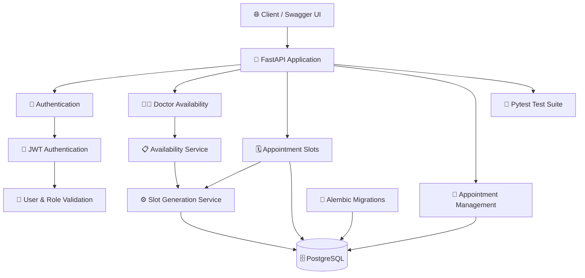
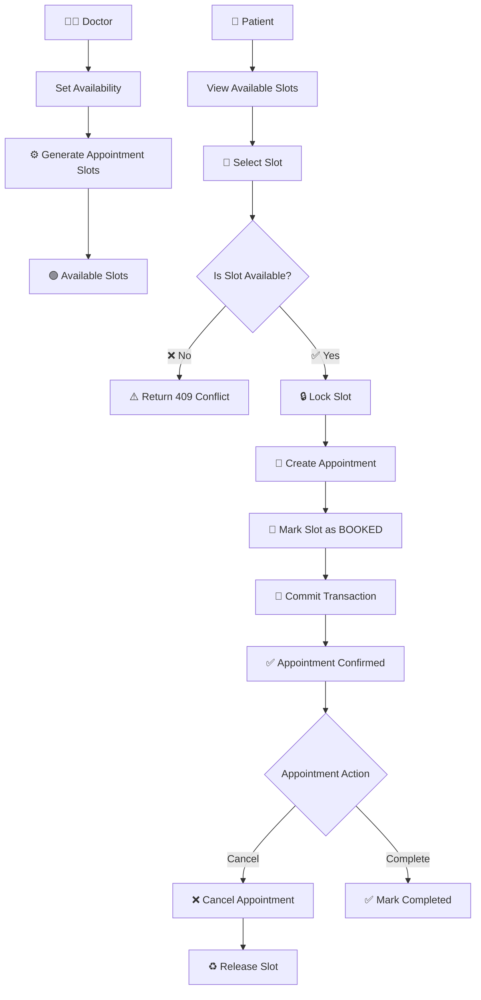
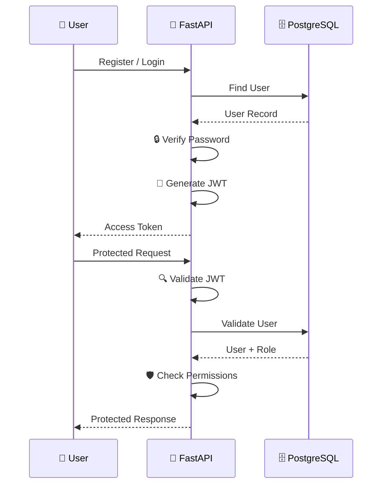
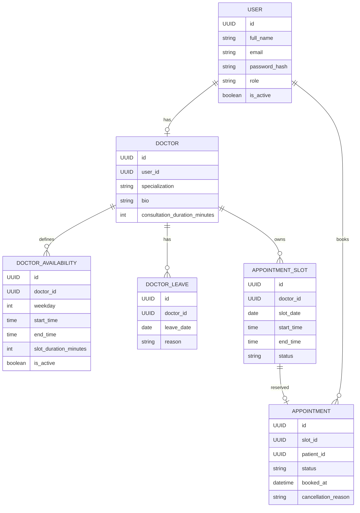

# 🏥 Healthcare Appointment Manager

> 🚀 An industry-level REST API for managing doctors, patient authentication, doctor availability, appointment slots, and healthcare appointments.

[](https://www.python.org/)
[](https://fastapi.tiangolo.com/)
[](https://www.postgresql.org/)
[](https://www.sqlalchemy.org/)
[](https://alembic.sqlalchemy.org/)
[](#-testing)

---

## 📌 Overview

The **Healthcare Appointment Manager** is a backend REST API designed to manage the complete appointment scheduling workflow between patients and doctors.

The system provides:

- 🔐 JWT-based authentication
- 👤 Patient and doctor role management
- 👨‍⚕️ Doctor availability management
- 🗓️ Appointment slot generation
- 📅 Appointment booking
- ❌ Appointment cancellation
- 🔄 Appointment status updates
- 🔒 Role-based authorization
- 🗄️ PostgreSQL persistence
- 🔧 Alembic database migrations
- 🧪 Automated API and service tests
- 📖 Interactive Swagger API documentation

The project focuses on building a reliable appointment-management backend with proper authentication, authorization, database transactions, validation, and test coverage.

---

# ✨ Key Features

## 🔐 Authentication & Authorization

The application uses JWT-based authentication.

### Supported roles

- 👤 Patient
- 👨‍⚕️ Doctor

Authentication flow:

```text
User
  ↓
Register / Login
  ↓
JWT Access Token
  ↓
Authenticated API Request
  ↓
JWT Validation
  ↓
User Lookup
  ↓
Role Validation
  ↓
Protected Resource

## 🏗️ System Architecture



## 📅 Appointment Booking Workflow



## 🔐 Authentication Flow



## 🗄️ Database Architecture



## 📸 API Demonstration

The API was tested using the built-in Swagger UI provided by FastAPI.

### 🚀 Swagger API Documentation

The Swagger interface provides interactive documentation for all available endpoints, including authentication, doctor availability, appointment slots, and appointment management.


---

### 🗓️ Appointment Management

The appointment module supports:

- 📋 Get patient appointments
- ➕ Create appointments
- ❌ Cancel appointments
- 👨‍⚕️ Get doctor appointments
- 🔄 Update appointment status


---

### 🔄 Appointment Status Update

Appointment status can be updated through the PATCH endpoint.

Example:

```json
{
  "status": "completed"
}
```


---

### 🔐 Authentication & Authorization

Protected endpoints use JWT Bearer authentication.

The Swagger UI allows authenticated requests through the **Authorize 🔒** button.


---

### 🧪 API Testing

The backend was tested through both automated tests and Swagger API execution.

```text
6 passed
```

Test coverage includes:

- ✅ Patient appointment booking
- ✅ Duplicate slot protection
- ✅ Appointment cancellation
- ✅ Slot release after cancellation
- ✅ Role-based authorization
- ✅ Doctor/patient access control
- ✅ Slot generation

---

### ⚠️ Error Handling

The API also validates invalid requests and unauthorized operations.

Example response:

```text
500 Internal Server Error
```

This screenshot represents an error encountered during API testing and is included as part of the debugging/testing process.


