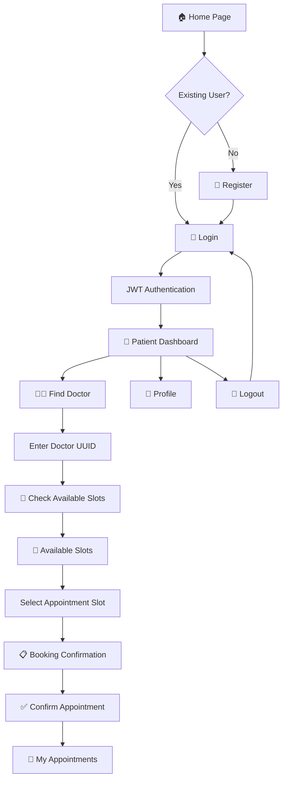
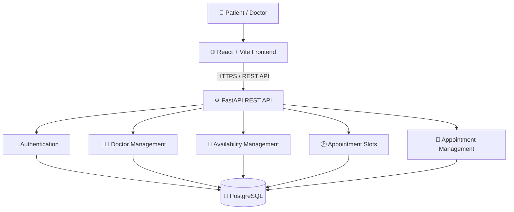
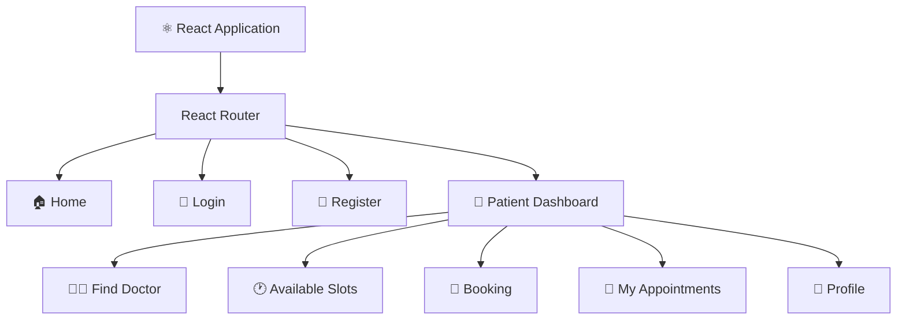
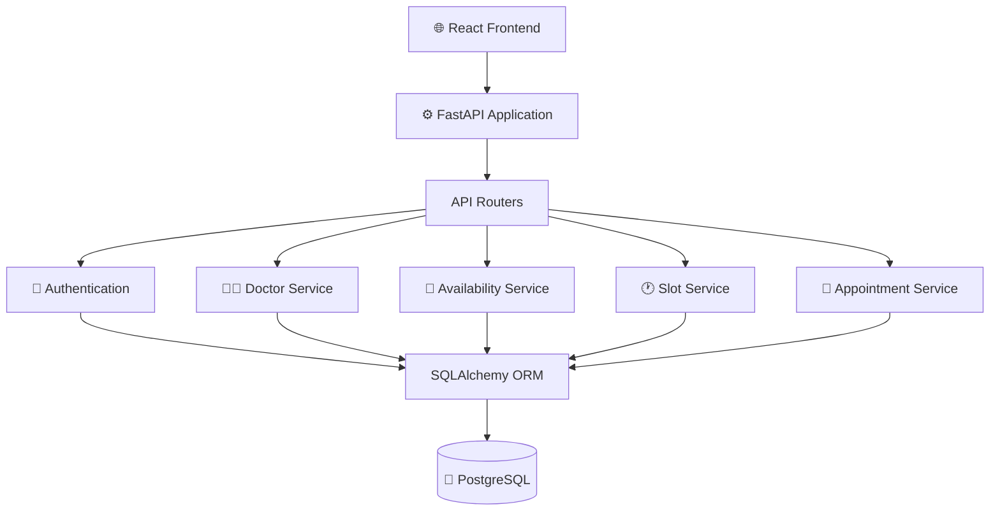
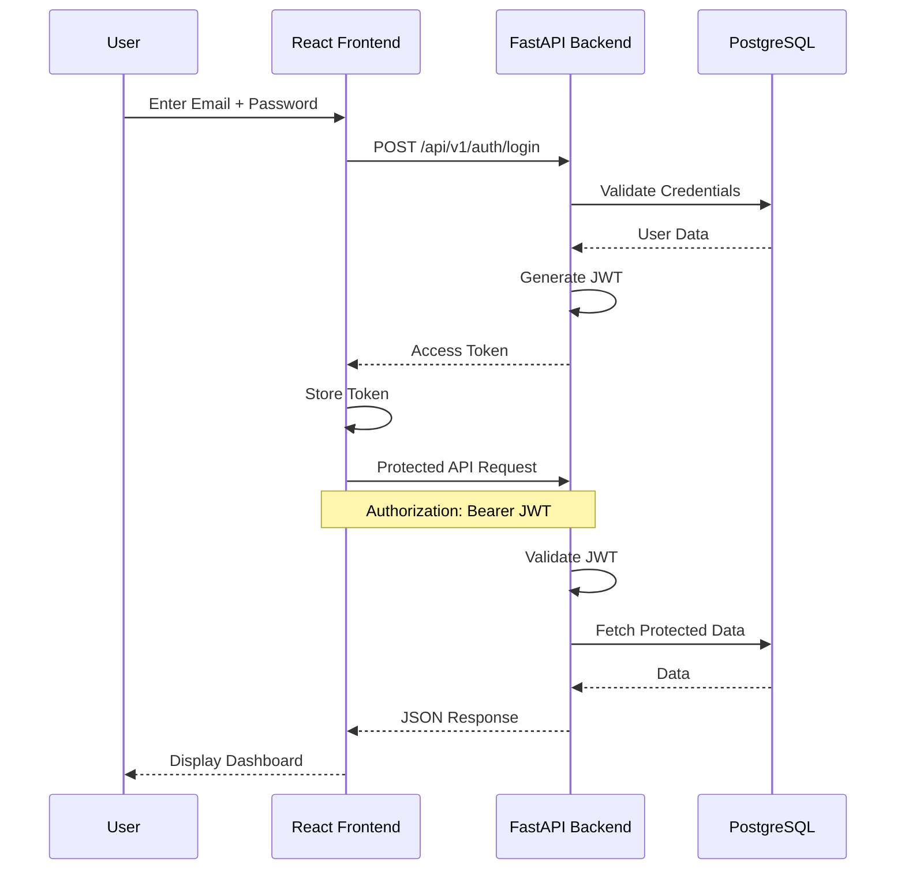
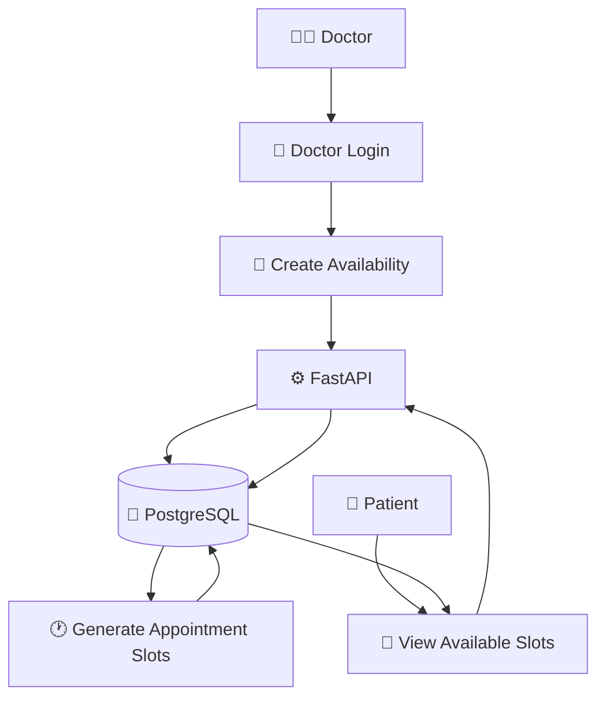
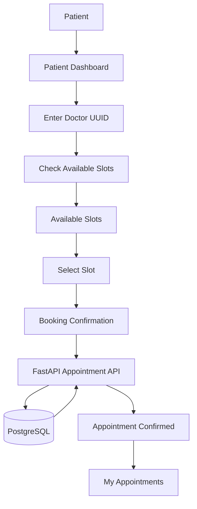
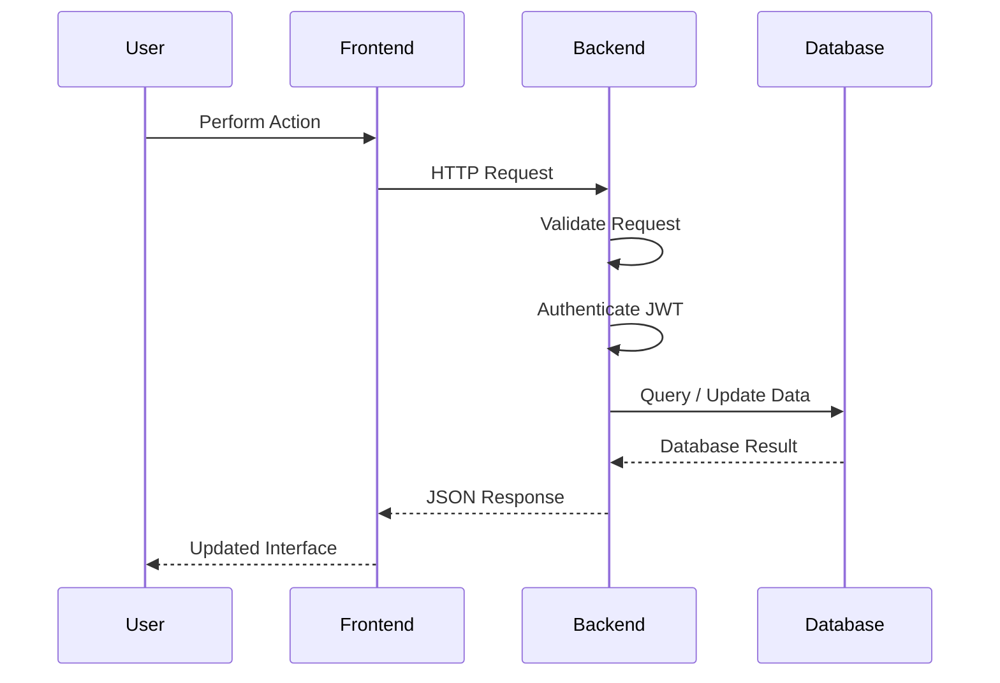
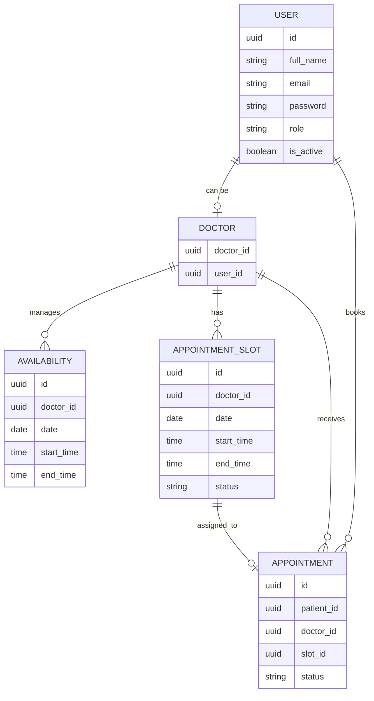
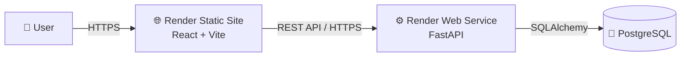

# 🏥 Healthcare Appointment Manager

<p align="center">
  
  
  
  
  
</p>

<p align="center">
  <b>A full-stack healthcare appointment management platform</b>
</p>

<p align="center">
  Secure Authentication • Doctor Management • Availability • Appointment Slots • Booking • Patient Dashboard
</p>

---

## 🌐 Live Demo

### 🚀 Frontend

**Live Application:**  
https://healthcare-appointment-frontend-mcla.onrender.com


### 📚 Swagger API Documentation

**Interactive API Docs:**  
https://healthcare-appointment-manager-sz8l.onrender.com/docs


---

# 📋 Table of Contents

- [Overview](#-overview)
- [Problem Statement](#-problem-statement)
- [Solution](#-solution)
- [Key Features](#-key-features)
- [Complete Application Workflow](#-complete-application-workflow)
- [System Architecture](#-system-architecture)
- [Frontend Architecture](#-frontend-architecture)
- [Backend Architecture](#-backend-architecture)
- [Authentication Flow](#-authentication-flow)
- [Doctor Availability Flow](#-doctor-availability-flow)
- [Appointment Booking Flow](#-appointment-booking-flow)
- [API Request Flow](#-api-request-flow)
- [Database Architecture](#-database-architecture)
- [Project Structure](#-project-structure)
- [Technology Stack](#-technology-stack)
- [Frontend Screenshots](#-frontend-screenshots)
- [Backend Screenshots](#-backend-screenshots)
- [API Endpoints](#-api-endpoints)
- [Local Setup](#-local-setup)
- [Deployment](#-deployment)
- [Security](#-security)
- [Testing](#-testing)
- [Project Status](#-project-status)
- [Future Improvements](#-future-improvements)
- [Author](#-author)

---

# 📖 Overview

**Healthcare Appointment Manager** is a full-stack web application designed to simplify and digitize healthcare appointment management.

The platform provides a centralized interface where users can:

- Create an account
- Login securely
- Access a personalized dashboard
- Find doctors
- Check doctor availability
- View available appointment slots
- Select an appointment
- Confirm an appointment
- View their appointments
- Manage their profile

The application consists of a **React + Vite frontend**, a **FastAPI REST backend**, and a **PostgreSQL database**.

Authentication is implemented using **JWT-based authentication**, while the backend provides interactive **Swagger/OpenAPI documentation**.

---

# 🎯 Problem Statement

Healthcare appointment management can become difficult when patients have to rely on manual scheduling systems.

Common problems include:

- Difficulty finding available doctors
- Lack of appointment visibility
- Manual appointment scheduling
- Difficulty managing appointments
- Lack of centralized healthcare information
- Security concerns around user accounts

The objective of this project is to provide a secure and user-friendly digital platform for managing healthcare appointments.

---

# 💡 Solution

The Healthcare Appointment Manager provides a complete digital workflow:

```text
User
 │
 ▼
Home Page
 │
 ▼
Register / Login
 │
 ▼
JWT Authentication
 │
 ▼
Patient Dashboard
 │
 ▼
Find Doctor
 │
 ▼
Check Doctor Availability
 │
 ▼
View Available Slots
 │
 ▼
Select Appointment Slot
 │
 ▼
Confirm Appointment
 │
 ▼
My Appointments
```

---

# ✨ Key Features

## 🔐 Authentication

- Patient registration
- Doctor registration
- Secure login
- JWT authentication
- OAuth2-compatible login
- Bearer token authorization
- Protected endpoints
- Role-based authorization
- Current-user endpoint
- Logout functionality

## 👨‍⚕️ Doctor Management

- Doctor accounts
- Doctor UUID identification
- Doctor availability
- Availability lookup
- Doctor-specific appointment slots
- Slot generation API

## 🕐 Appointment Slots

- View doctor slots
- Slot date and time
- Slot availability status
- Doctor-specific slots
- Appointment slot selection

## 📅 Appointment Management

- Appointment booking workflow
- Appointment confirmation
- My Appointments
- Appointment status
- Appointment cancellation through API
- Authenticated appointment access

## 👤 Patient Dashboard

- Overview
- Quick actions
- Find Doctor
- Available Slots
- My Appointments
- Profile
- Account information
- Logout

---

# 🔄 Complete Application Workflow



---

# 🏗️ System Architecture



---

# 🏛️ Three-Tier Architecture

```text
┌────────────────────────────────────────────────────┐
│                 PRESENTATION LAYER                 │
│                                                    │
│                  React + Vite                     │
│                                                    │
│  Home │ Login │ Dashboard │ Slots │ Appointments │
└─────────────────────────┬──────────────────────────┘
                          │
                          │ REST API
                          ▼
┌────────────────────────────────────────────────────┐
│                  APPLICATION LAYER                 │
│                                                    │
│                    FastAPI                         │
│                                                    │
│ Authentication │ Doctors │ Slots │ Appointments  │
└─────────────────────────┬──────────────────────────┘
                          │
                          │ SQL / ORM
                          ▼
┌────────────────────────────────────────────────────┐
│                     DATA LAYER                     │
│                                                    │
│                   PostgreSQL                       │
│                                                    │
│ Users │ Doctors │ Availability │ Slots │ Bookings │
└────────────────────────────────────────────────────┘
```

---

# 🎨 Frontend Architecture



---

# ⚙️ Backend Architecture



---

# 🔐 Authentication Flow



---

# 👨‍⚕️ Doctor Availability Flow



---

# 📅 Appointment Booking Flow



---

#  API Request Flow



---

#  Database Architecture



---

# ☁️ Deployment Architecture



---

# 📂 Project Structure

```text
healthcare-appointment-manager/
│
├── backend/
│   │
│   ├── app/
│   │   ├── main.py
│   │   ├── models/
│   │   ├── schemas/
│   │   ├── routers/
│   │   ├── services/
│   │   └── ...
│   │
│   ├── frontend/
│   │   ├── public/
│   │   ├── src/
│   │   │   ├── assets/
│   │   │   ├── App.jsx
│   │   │   ├── App.css
│   │   │   └── main.jsx
│   │   ├── package.json
│   │   ├── package-lock.json
│   │   ├── vite.config.js
│   │   └── index.html
│   │
│   ├── alembic/
│   ├── tests/
│   ├── requirements.txt
│   ├── alembic.ini
│   └── test_db.py
│
├── docs/
│   └── screenshots/
│       ├── frontend-home.png
│       ├── frontend-login.png
│       ├── frontend-dashboard.png
│       ├── frontend-find-doctor.png
│       ├── frontend-slots.png
│       ├── frontend-booking.png
│       ├── frontend-confirmation.png
│       ├── frontend-appointments.png
│       ├── frontend-profile.png
│       ├── backend-swagger.png
│       ├── backend-authentication.png
│       ├── backend-doctor-availability.png
│       ├── backend-slots.png
│       └── backend-appointments.png
│
├── .gitignore
└── README.md
```

---

# 🛠️ Technology Stack

| Technology | Purpose |
|---|---|
| React | Frontend UI |
| Vite | Frontend build tool |
| React Router | Client-side routing |
| JavaScript | Application logic |
| CSS | Styling |
| Lucide React | UI icons |
| FastAPI | REST API |
| Python | Backend |
| Uvicorn | ASGI server |
| SQLAlchemy | ORM |
| Pydantic | Data validation |
| JWT | Authentication |
| OAuth2 | Authentication flow |
| Alembic | Database migrations |
| PostgreSQL | Database |
| Git | Version control |
| GitHub | Repository |
| Render | Deployment |

---

# 🖥️ Frontend Screenshots

> Place your screenshots inside `docs/screenshots/`.

## 🏠 Home Page


---

## 🔐 Login Page


---

## 👤 Patient Dashboard


---

## 👨‍⚕️ Find Doctor


---

## 🕐 Available Appointment Slots


---

## 📅 Book Appointment


---

# ⚙️ Backend Screenshots

## 📚 Swagger API Documentation


---

## 🔐 Authentication APIs


---

# 📡 API Endpoints

## 🔐 Authentication

### Register

```http
POST /api/v1/auth/register
```

### Login

```http
POST /api/v1/auth/login
```

### Get Current User

```http
GET /api/v1/auth/me
```

---

## 👨‍⚕️ Doctor Availability

### Create Availability

```http
POST /api/v1/doctors/{doctor_id}/availability
```

### Get Availability

```http
GET /api/v1/doctors/{doctor_id}/availability
```

---

## 🕐 Appointment Slots

### Generate Appointment Slots

```http
POST /api/v1/doctors/{doctor_id}/slots/generate
```

### Get Doctor Slots

```http
GET /api/v1/doctors/{doctor_id}/slots
```

---

## 📅 Appointments

### Get My Appointments

```http
GET /api/v1/appointments
```

### Create Appointment

```http
POST /api/v1/appointments
```

### Cancel Appointment

```http
DELETE /api/v1/appointments/{appointment_id}
```

---

# 📚 Swagger / OpenAPI

FastAPI automatically provides interactive API documentation.

### Production Swagger

https://healthcare-appointment-manager-sz8l.onrender.com/docs

Swagger allows developers to test:

```text
Authentication
      ↓
Current User
      ↓
Doctor Availability
      ↓
Appointment Slots
      ↓
Appointments
```

---

# 💻 Local Development

## 1. Clone Repository

```bash
git clone https://github.com/Sonali1554/healthcare-appointment-manager.git
```

```bash
cd healthcare-appointment-manager
```

---

# ⚙️ Backend Setup

Navigate to the backend:

```powershell
cd backend
```

Create a virtual environment:

```powershell
python -m venv venv
```

Activate it:

```powershell
.\venv\Scripts\activate
```

Install dependencies:

```powershell
pip install -r requirements.txt
```

Start FastAPI:

```powershell
uvicorn app.main:app --reload
```

Backend:

```text
http://127.0.0.1:8000
```

Swagger:

```text
http://127.0.0.1:8000/docs
```

---

# 🎨 Frontend Setup

Open another terminal.

```powershell
cd backend/frontend
```

Install dependencies:

```powershell
npm install
```

Start Vite:

```powershell
npm run dev
```

Frontend:

```text
http://localhost:5173
```

If port 5173 is already occupied, Vite automatically selects another available port.

---

# 🚀 Production Deployment

## Frontend

The React/Vite frontend is deployed as a Render Static Site.

### Render Configuration

```text
Root Directory:
backend/frontend

Build Command:
npm install && npm run build

Publish Directory:
dist
```

### Live Frontend

https://healthcare-appointment-frontend-mcla.onrender.com

---

## Backend

The FastAPI backend is deployed as a Render Web Service.

### Live Backend

https://healthcare-appointment-manager-sz8l.onrender.com

### Swagger

https://healthcare-appointment-manager-sz8l.onrender.com/docs

---

# 🔒 Security

The application implements:

- JWT authentication
- OAuth2-compatible authentication
- Bearer token authorization
- Protected API endpoints
- Role-based authorization
- Authenticated user validation
- Active-user validation
- Password authentication
- Input validation
- CORS configuration
- API-level access control

---

# 🧪 Testing

Backend tests can be executed using:

```bash
pytest
```

API endpoints can also be manually tested through Swagger:

https://healthcare-appointment-manager-sz8l.onrender.com/docs

---

# 📊 Project Status

| Component | Status |
|---|---|
| React Frontend | ✅ Working |
| Vite Build | ✅ Working |
| FastAPI Backend | ✅ Working |
| PostgreSQL | ✅ Configured |
| JWT Authentication | ✅ Working |
| Patient Registration | ✅ Working |
| Doctor Registration | ✅ Working |
| Patient Login | ✅ Working |
| Doctor Login | ✅ Working |
| Patient Dashboard | ✅ Working |
| Find Doctor | ✅ Working |
| Available Slots UI | ✅ Working |
| Slot Selection | ✅ Working |
| Booking Confirmation UI | ✅ Working |
| My Appointments UI | ✅ Working |
| Swagger Documentation | ✅ Working |
| Backend Deployment | ✅ Live |
| Frontend Deployment | ✅ Live |
| GitHub Repository | ✅ Updated |

---

# ⚠️ Implementation Note

During development, authorization behavior of some backend appointment and slot operations was tested through Swagger.

The frontend currently contains a UI fallback for the slot and booking demonstration so that the complete appointment experience can be demonstrated through the deployed frontend.

The authentication flow and authenticated user information were successfully verified against the deployed backend.

The backend appointment and slot APIs remain available through Swagger for further backend integration and authorization refinement.

---

# 🔗 Important Links

| Resource | Link |
|---|---|
| 🌐 Live Frontend | https://healthcare-appointment-frontend-mcla.onrender.com |
| ⚙️ Backend API | https://healthcare-appointment-manager-sz8l.onrender.com |
| 📚 Swagger Docs | https://healthcare-appointment-manager-sz8l.onrender.com/docs |
| 💻 GitHub | https://github.com/Sonali1554/healthcare-appointment-manager |

---

# 👩‍💻 Author

## Sonali Kumari

**B.Tech — Computer Science and Engineering**  
**VIT Bhopal University**

---

<p align="center">

### 🏥 Healthcare Appointment Manager

**Secure • Simple • Scalable Healthcare Appointment Management**

</p>
